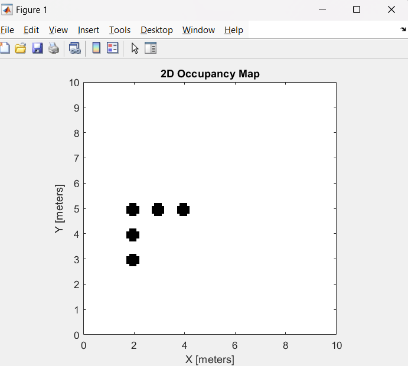
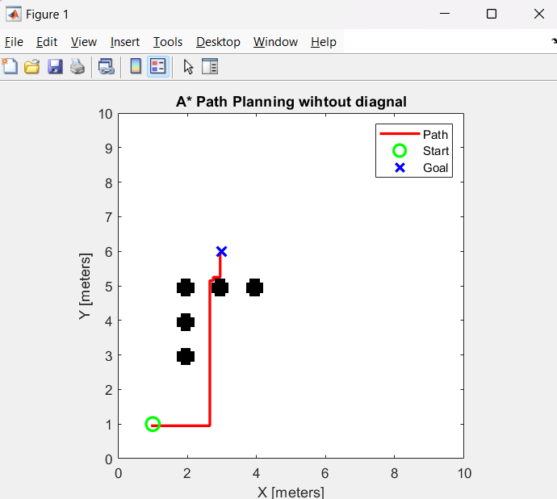
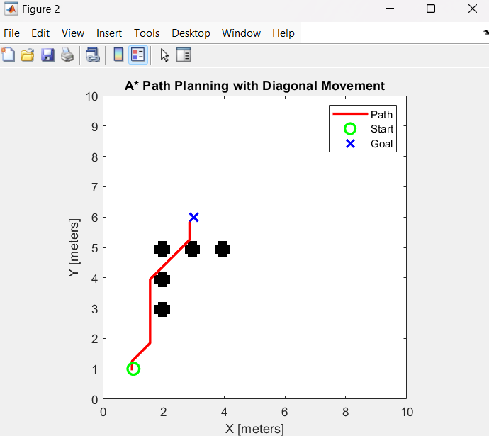
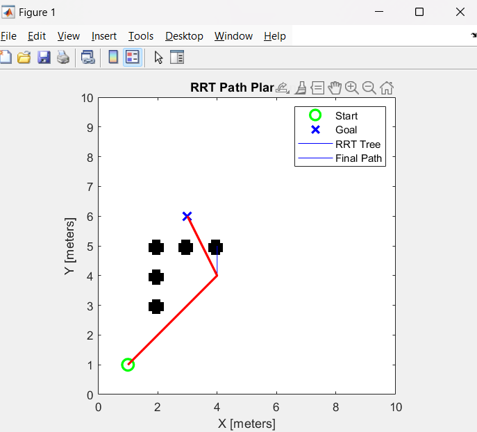

# Robot Path Planning using A* and RRT

This project implements and compares two popular path planning algorithms: **A\*** (Search-Based) and **RRT** (Sampling-Based), for robotic navigation in a 2D environment.

## Project Overview

The core goal of path planning is to determine a **collision-free** and **optimal path** from a **start** to a **goal pose**. Each pose (or **state**) is defined by:

- **x**: position on the X-axis  
- **y**: position on the Y-axis  
- **θ (theta)**: orientation of the robot  

A path is simply a sequence of these pose states that allows the robot to move smoothly through its environment.

---

## What is a 2D Occupancy Grid?

A **2D occupancy grid** is a data representation of the robot’s environment, where the space is discretized into a grid of cells. Each cell holds a value representing whether the area is:

- **Occupied (1)**: Contains an obstacle  
- **Free (0)**: Safe for navigation  
- **Unknown (-1)**: Not yet explored or mapped

This grid acts as a simplified model of the environment for algorithms to work with.

---

## What is Path Planning?

Path planning refers to finding a feasible and optimal route between a starting and a target location for a robot. The **straight line** is usually the **minimum distance**, but due to obstacles, we aim for an **optimal path** that avoids collisions while minimizing travel cost.

Two main approaches are:
- **Graph-Based Planning (e.g., A\*)**
- **Sampling-Based Planning (e.g., RRT)**

---

## Search-Based Planning – A\* Algorithm

A\* (A-star) is a popular graph-based path planning algorithm that operates by discretizing the environment into **nodes** and finding the shortest path between them.

### How It Works:
1. Start from the **initial node**.
2. Expand the most promising node based on a **cost function** `f(n) = g(n) + h(n)`:
   - `g(n)`: Cost from start to current node  
   - `h(n)`: Heuristic (estimated cost from current to goal)
3. Continue expanding until the **goal node** is reached.
4. Backtrack to reconstruct the optimal path.

### Pros:
- Finds the shortest path
- Optimal and complete in a grid-based environment

---

##  Sample-Based Planning – RRT (Rapidly-exploring Random Tree)

RRT is a sampling-based path planner that builds a random tree toward the goal.

###  How It Works:
1. Start from the **initial node** (start pose).
2. Generate random samples (pose states) in the space.
3. Extend the tree toward each random sample, avoiding obstacles.
4. When a sample is close to the goal, a path is formed.

Initially, the path might not be optimal. To improve:
- Keep expanding and sampling
- If a new sample reaches a node already on the path:
  - Compare path costs
  - Retain the lower-cost path
- As the number of samples → ∞, the solution → optimal

### Pros:
- Efficient in high-dimensional spaces
- Works well in complex, dynamic environments

---

## Screenshots

